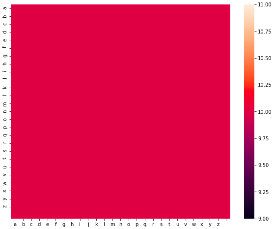
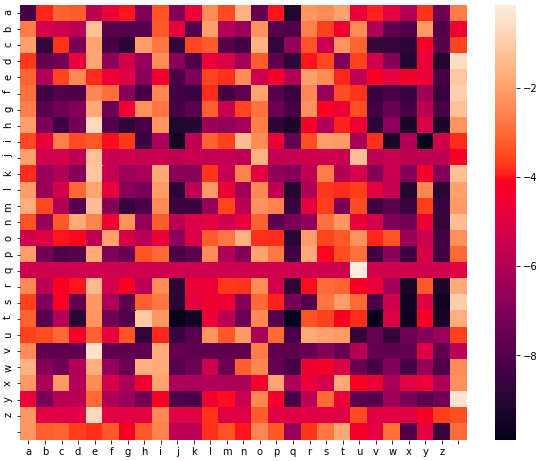

## Gibberish Detection

### What is it?
> Gibberish looks like real words, but it really has no meaning at all. 
Example - hhduaihd

### Requirements
1. numpy
2. seaborn

> pip install -r requirements.txt

### Experiment 1:
1. Define accepted characters as [a-z ].
2. Create method to Tokenize at character level.
3. Create method to generate ngram.
4. Create a 27x27 matrix with 10 as initial value.
    - This matrix will tell us the probability of getting 2 characters simultaneouly.
    - Initially it is set to 10 because if new word occurs which we haven't seen then we don't want it's probability to be zero.
5. The heatmap of probabilities will look like this

The heatmap is uniform because the probability is same for every pair.
6. Take a large corpus and read every line.
    - Tokenzie each line and calculate ngram.
    - Increase the count in probability matrix with 1 on each occurance of a character pair.
7. Now, we need some way to normalize these probabilites. For that I've divided every row by its sum and taken log of it.
8. After getting normalized the heatmap of probabilities looks like this.
 
9. How to decide whether the word gibberish or not. For that we can try 2 approaches
    - Multiply the probabilites of ngrams in Markov Chain fashion.
    - Add the probabilites of ngrams.
> Adding probabilies seems good option because if a low probability ngram occurs then it will impact the whole accuracy drastically whereas addition we not cause that much impact.
10. For prediction, we will generate ngrams and add the probabilities.

### Contribution
Please refer to [CONTRIBUTIONS.md](CONTRIBUTING.md) 

### Reference
- https://github.com/rrenaud/Gibberish-Detector